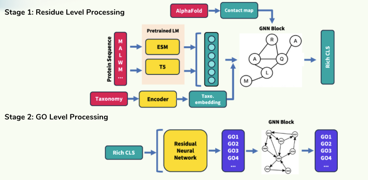

# NucleAIse
This readme will act as a guide for understanding this repository, where everything is and how they all work together 

## TODO:
- implement taxonomy mapping
- figure out how to create a data server to host the data on cluster , since we are currently reading from a local pgAdmin data server

## Model Architecuture
<center>
  
</center>

## Assumptions
- There are 3 ontologies in GOA and these 3 ontologies are seperate, we can treat them as seperate Directed Acyclic Graphs. 
- we only consider the top K most frequent labels in the Gene Ontology tree for predictions
    - what this means is that we only select K labels from the gene ontology tree and these K labels have the highest frequency in occurence throughout our dataset
- we use PyG to do all of our graph processing
    - in PyG we represent our graphs using `Data` objects, each Data object has a few attributes
        1) `x`: the nodes features (shape: num_of_nodes x node_feature_dimension)
        2) `edge_index`: the edge_index list or adjacency showing how the graph is connected (shape: 2 x num_of_edges)
        3) `edge_attr`: the edge attributes or edge features (shape: num_of_edges x edge_feature dimension)
        4) `y`: the output list (this is to be freely defined based on your applcation, for us this vector will be shape (batch_size*num_of_goas)) 
    - when you have multiple graphs, you can create multiple `Data` objects and put them in a list and stack them into a larger graph:
    ```python
    x1 = torch.rand(5,10)
    edge_index1 = torch.randint(0,5,(2,10))
    x2 = torch.rand(10,10)
    edge_index2 = torch.randint(0,5,(2,10))
    d = []
    d1 = Data(x=x1,edge_index=edge_index1)
    d.append(d1)
    d2 = Data(x=x2,edge_index = edge_index2)
    d.append(d2)
    b = Batch.from_data_list(d)
    
    #The resulting shapes of b in this example:
    #b.x: (shape: 15 x 10): the node feature matrices are stacked together
    #b.edge_index: (shape: 2,20): the egdes are stacked in dim=1 
    #b.batch ***: (shape: 15): tells PyG which nodes belong to which graph [0,0,0,0,0,1,1,1,1,1,1,1,1,1,1]
    #b.ptr ***: (shape: 3), acts as list of pointers of where the edge_index is for each graph

    #You can run your model through this batch object
    out = model(b)
    loss = loss_fn(out,b.y)
    loss.backwards()
    ```
- we use nn.Embedding to encode our taxonomy information into embeddings that are trainable
-  


## Main components:
- **GO graph construction:** /preprocessing/db_go.py
    - The purpose of this script is for constructing the Gene Ontology sub graph, which is needed for GO-graph processing
    1)  We connect to our dataset first, iterate through all the proteins in our database and record how many instances there are for all the GO-labels 
    2)  We create a GOSubDag object from the [goatools](https://github.com/tanghaibao/goatools) and this object receives the raw list of GOAs collected from our dataset (the one not considering the ancestors of GOAs of each sample), then during construction of this object, it correctly counts the occurences of each GOA which accounts for all its ancestors as well. From this object we can access attributes such as parents,children, depth, level, count (which is the frequency of occurence of that GOA)
    3)  Once we have the correct occurences, we then perform depth-first search to traverse down the tree from the 3 roots (1 root for each ontology), each iteration we sort all the nodes from highest to lowest in occurence, so we always traverse the nodes with highest occurence first. Once the traversal is complete, we select the top K nodes that form a subgraph
    4)  Once we have the subgraph we can construct the edge_index list (basically the adjacency matrix)
    5) So at the end what is returned from the scripts? we create a pt file that stores the following information for our subgraph:
        -   {ontology}_go_to_index: a mapping that goes from GO label to index
        -   {ontology}_index_to_go: a mapping that goes from index to GO label
        -   {ontology}_edge_index : the edge index list (basically the adjacency matrix) of shape (2,number of edges)
        -   go_set: the raw list of GO labels from our dataset
    - **Note:** we cannot directly collect all the GO labels in our protein, why? because the labels shown for each protein do not account for its parents. If one row in the database is like this (sequence: AMOSJJHEG..., goa: [GO:000345,GO:000123]), this representation would say GO:000345 occured once and same for GO: 000123, but this does not consider the parents of (GO: 000345 and GO:000123). So if GO:000345 has 1 parent GG:000998, the actual labels associated to this protein are goa:[GO:000345,GO:000123, GO:000998]

- **ProteinDataset definition**: /preprocessing/data_factory.py
    - The purpose of this class is to help create a pipeline for loading data, processing data from our database and collating them into batches that can be used in training
    - How it works:
    ```python
    d = ProteinDataset(dataset_type,batch_size,percent_sample, pool, loop, embedding,...)
    for batch in d:
        y = model(batch)
        #run your training loop code
    ```
    - the Dataset class has a lot different helper functions for making forward passes to the language models, constructing the correct target vectors
    - during every training iteration, `__aiter__` gets called and we call `self.get_protein_batch()` 
    - What does `self.get_protein_batch()` do? 
        - 1) goes through our database and sample `batch_size` number of proteins from it, (we keep track of the proteins we have selected previously and do not reselect them)
        - 2) goes through the batch we queried from the db and compute the node embeddings by calling `get_esm()` or `get_t5()` which just processes the sequence and turn them into embeddings
        - **NOTE:** we currently obtain our contact map through esm (i.e. running esm also returns a num_of_residues x num_of_residues matrix, however it is a self attention map obtained from the transformer layers)
        - 3) we construct the edge_index (shape: 2 x num_of_edges) and edge_attr (shape:  num_of_edges x edge_feature_dim) from the attention map, we also construct the correct target vector with the function `self.get_target`
        - 4) with all this information we can create `Data` objects from PyG which is just a way of representing 1 graph (node features, connections, edge features, output...). With a list of `Data` objects you can create a `DataBatch` which is just multiple graphs stacked together to form 1 big graph so if your batch size is 4, DataBatch will have 4 graphs stacked into 1. 
    - each iteration of the training loop `for b in d:` the b returns this DataBatch object

- **Pipeline definition**: /pipeline/pipeline.py
    - The purpose of this class is to define a pipeline class for us to run our training and load our data, run validation
    - How does it work?
        1) Construct the pipeline and the model
        2) We call load_data, which constructs the `ProteinDataset` from data_factory.py
        3) We call `pipeline.train()` which starts the training loop 
    - Some helper functions for `load_data`:
        - `load_taxonomy`: NOT YET COMPLETE but basically assuming we have a dictonary that goes from taxonomy to index and vice versa we use that to tokenize the taxonomies. 
        - `load_goa`: this function loads the pt files to obtain the 3 things: go_set (the raw list of GOAs from our database), the edge_index (the connections of the GO tree), the index_to_go and go_to_index mappings
    - We have a train function which acts as the training loop, it is a typical training loop 
- **Model definition**: /models/deepgnn.py
    - This python script outlines the model definition of our main model
    ```python
    Model(
    #GNN Block 1: doing residual level graph processing

    #Each GNN Block has the following structure:
    # GCN Layer (graph convolution)
    # LayerNormalizaiton
    # SelfAttentionLayers

    #input shape: (num_of_residues x 1280)
    #output shape: (num_of_residues x 1024)
  (blocks): Sequential(
    (0): GNNBlock(
      (model): GCNConv(1280, 1000)
      (activation): ReLU()
      (dropout): Dropout(p=0.5, inplace=False)
    )
    (1): LayerNorm((1000,), eps=1e-05, elementwise_affine=True)
    (2): SelfAttention(
      (in_proj): Linear(in_features=1000, out_features=3000, bias=True)
      (out_proj): Linear(in_features=1000, out_features=1000, bias=True)
    )
    (3): SelfAttention(
      (in_proj): Linear(in_features=1000, out_features=3000, bias=True)
      (out_proj): Linear(in_features=1000, out_features=1000, bias=True)
    )
    (4): LayerNorm((1000,), eps=1e-05, elementwise_affine=True)
    (5): GNNBlock(
      (model): GCNConv(1000, 1024)
      (activation): ReLU()
      (dropout): Dropout(p=0.5, inplace=False)
    )
    (6): LayerNorm((1024,), eps=1e-05, elementwise_affine=True)
    (7): SelfAttention(
      (in_proj): Linear(in_features=1024, out_features=3072, bias=True)
      (out_proj): Linear(in_features=1024, out_features=1024, bias=True)
    )
    (8): SelfAttention(
      (in_proj): Linear(in_features=1024, out_features=3072, bias=True)
      (out_proj): Linear(in_features=1024, out_features=1024, bias=True)
    )
    (9): LayerNorm((1024,), eps=1e-05, elementwise_affine=True)
  )
  #We perform mean aggregation to obtain a global representation or embedding (CLS embedding) to be passed to the residual
  #Input shape: (num_of_residues x 1024)
  #output shape: (1 , 1024)
  (aggr): MeanAggregation()

  #This is the embedding layer to maps a taxonomy to an embedding that is trainable
  #Input shape: (1000)
  #output shape: (1 , 1024)
  (tax_emb): Embedding(1000, 1024)

  #The residual network is simply a bunch of linear layers stacked together with residual connections, residual connections help tackle vanishing gradients and to help the model learn the identity mapping

  #Input shape: (1, 1024)
  #output shape: (1 , num_of_goas)
  (residual_block): ResidualNetwork(
    (forward_linear1): Linear(in_features=1024, out_features=1024, bias=True)
    (batchnorm1): BatchNorm1d(1024, eps=1e-05, momentum=0.1, affine=True, track_running_stats=True)
    (activation1): ReLU()
    (dropout1): Dropout(p=0.5, inplace=False)
    (pred_linear1): Linear(in_features=1024, out_features=2, bias=True)
    (sigmoid1): Sigmoid()
    (forward_linear2): Linear(in_features=1026, out_features=1026, bias=True)
    (batchnorm2): BatchNorm1d(1026, eps=1e-05, momentum=0.1, affine=True, track_running_stats=True)
    (activation2): ReLU()
    (dropout2): Dropout(p=0.5, inplace=False)
    (pred_linear2): Linear(in_features=1026, out_features=2, bias=True)
    (sigmoid2): Sigmoid()
    (forward_linear3): Linear(in_features=1028, out_features=1028, bias=True)
    (batchnorm3): BatchNorm1d(1028, eps=1e-05, momentum=0.1, affine=True, track_running_stats=True)
    (activation3): ReLU()
    (dropout3): Dropout(p=0.5, inplace=False)
    (pred_linear3): Linear(in_features=1028, out_features=2, bias=True)
    (sigmoid3): Sigmoid()
    (forward_linear4): Linear(in_features=1030, out_features=1030, bias=True)
    (batchnorm4): BatchNorm1d(1030, eps=1e-05, momentum=0.1, affine=True, track_running_stats=True)
    (activation4): ReLU()
    (dropout4): Dropout(p=0.5, inplace=False)
    (pred_linear4): Linear(in_features=1030, out_features=4, bias=True)
    (sigmoid4): Sigmoid()
    (forward_linear5): Linear(in_features=10, out_features=1000, bias=True)
  )
  #GNN Block 2: This is the GO Block GNN model, currently using a DAGNN model (we can explain this on a seperate basis if needed)
  #This model is inactive right now, not being trained with main model
  (go_block): GOBlock(
    (activation): SiLU()
    (linear_1): Linear(in_features=1, out_features=50, bias=True)
    (linear_2): Linear(in_features=50, out_features=100, bias=True)
    (go_layers): Sequential(
      (0): GNNBlock(
        (model): DAGNN(
          (node_aggr_0): ModuleList(
            (0-1): 2 x AttnConv()
          )
          (node_aggr_1): ModuleList(
            (0-1): 2 x AttnConv()
          )
          (cells_0): ModuleList(
            (0): GRUCell(100, 200)
            (1): GRUCell(200, 200)
          )
          (cells_1): ModuleList(
            (0): GRUCell(100, 200)
            (1): GRUCell(200, 200)
          )
          (final_linear_1): Linear(in_features=900, out_features=100, bias=True)
          (final_linear_2): Linear(in_features=100, out_features=50, bias=True)
          (final_linear_3): Linear(in_features=50, out_features=1, bias=True)
          (final_activation): SiLU()
          (output_activation): Sigmoid()
          (dropout): Dropout(p=0.0, inplace=False)
          (graph_pred_linear_list): ModuleList()
        )
        (activation): ReLU()
        (dropout): Dropout(p=0.5, inplace=False)
            )
            )
        )
        )
    ```