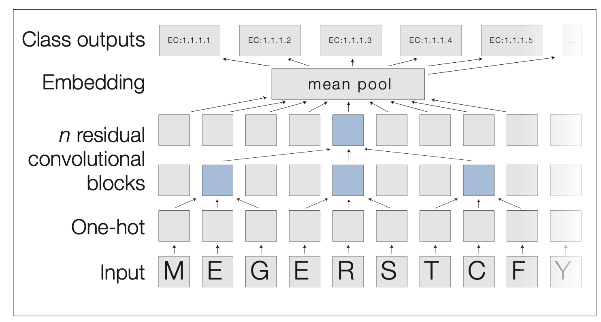

# Literature Review
This markdown file will contain all the most S.O.T.A research on models that have been developed to tackle 
protein function prediction tasks. I will describe their novel approaches and their motivations behind them, how it improved upon existing methods and their performance.

## ESM + GearNet (2023 Oct 18)
- Paper link: [click here](https://arxiv.org/pdf/2303.06275.pdf)
- Main ideas:
    - considered different types of fusion techniques for incorporating sequence and structure representations (serial, parallel, cross)
        - Serial fusion: intialize structure encoder input node features with residue type embeddings from ESM $u^0 = h ^{(L)}$ and $z = u^L$
        - Parallel fusion: concatenate outputs of sequence encoders and structure encoders to get final representation $z = [h^{(L)},u^{(L)}]$
        - Cross fusion: use cross attention over sequence and structure representations $z_i = SelfAttn([h_i^{(L)},u_i^{(L)}])$
    - Used ESM as the protein language model ot sequence encoder
    - Discussed AlphaFold2 as the protein structure predictor model
    - Explored 3 types of protein structure encoders:
        - GearNet
        - GVP
        - CDConv
- Diagram:

## TransFUN (2023 Jun 30)
- Paper link: [click here](https://watermark.silverchair.com/btad208.pdf?token=AQECAHi208BE49Ooan9kkhW_Ercy7Dm3ZL_9Cf3qfKAc485ysgAAA4IwggN-BgkqhkiG9w0BBwagggNvMIIDawIBADCCA2QGCSqGSIb3DQEHATAeBglghkgBZQMEAS4wEQQMO2rMh1Cg37lAVY_AAgEQgIIDNdjNwvXFO0B0dG2E5-qqZtkEWs1ED3X4QNg9IAz3thA2AuSD3K2OqCoeXipJRr80S2Hj7AOH9TPYAGwTQb_IIYr-IY4jlUistIPGyX0Xgfg96dt5DsLKvYRoFyThTAfUZxJlo2U5V65FMaDTUH8tV20fVdqZ1jlZ2VzOuqwpu5XmZlVmOKktZi2S2whVO3XZn2Qij4g1P6kAfJg9dpuLKaX3utWn84H5KhIbwg4xInSzjaiW3PYIzeGDnQ6jktkU0_LmD3Lel3kjvV6fEMrJ1IREgnFLRZ4UWfRGQxihlqV-4Mt3PNpVGkR3AsAjTg--hVPAcdl6czvf9YWV7s1HJ4fniOwh3pg870VP-In5PQKLy9LQAOECl3r7_Y7UEAPHI829x_XwPJpJ_OsxK5xFIIO_kvIEu2B-fdu579HlaXNyP8i95VR3bqcc-R_OoM9RboaUfJRhomP9TXKMECaUXl5oXWU1OY0IXmVf9vUaCmLm7IZUqZq20xmMVNYaMdFnpaqswEpXU5meGvNtybTOmtsUhxVXcbuws_AJEDN3ylfbfeJYNM7aa91NPn-vq-c_G_SNt0jiwPy9GQejM1GcmNSPettH4X9co-4Hjv-VEc-4DFEHTaVyuge5ruAKrvvxfpn6eRIz9tF6FTAjd-rkpkd5LKedQNGFilhK8azepDipcRJMRZPJQPyMRazG-bTt6eAexMkpteaQ73B3qLGL3NMOz5tFs2W7kexOPYCrCPl5pjt_By03_YeJob3Ie16zCqXNN6skAsFb-W3Cj5OrC8PLvhiOLNfrqH5nXtOBd0fAtCe_H0UY9TxEq2a5l4o5IHN06qmhFo1J8opGB3n_z-QGH9AgaGnH_Xrl_JlzLfIZqhA4Pgn9ojRBcRn56FmwUGy3X-Kc508vJzLXF5r1lfpxqukG66tCpT9VokWu2fHHRLc_AvEx4XY8jFwWT6zvsWjpRvJOYQ9rFiJQdcOSuvgO9R6Hc9ZA_XFUy3azEDCgspdIp-TwNq5Cp1tuAnyA3vKUdywN10grUKwLTfZ5xutjg11WrJypiqbfGiBBnKmBEwAoZ6lK38QkQN2M3aWrTiFHTh3V)
- Main ideas:
    - protein contact maps are constructed either using a distance threshold or KNN approach
    - used AlphaFold to construct the adjacency matrices/contact maps
    - used ESM-1b to obtain sequence embeddings
    - used Equivariant Graph Neural Networks for processing residue graphs with ESM as node features (not much explanation on motivation for using EGNN) followed by MLP then to predictions
    - used class weights to scale training loss
- Diagram:

## TEMPROT (2023 Jun 08)
- Paper link: [click here](https://bmcbioinformatics.biomedcentral.com/articles/10.1186/s12859-023-05375-0)
- Main ideas:
    - used Prot-BERT model to finetune, using transformer as feature extractor
    - BERT cannot cope with sequences longer than 512 amino acid and computational limits with attention, they use sliding window technique
    - for each window you get a subsequence or smaller sequence that BERT can process and produce predictions
    - 2 stage training process
        1) fine tune bert on dataset with the slicing technique that can make predictions
        2) use bert model as embedding extractor, combine and pass embeddings to meta classififer
- Diagram:

## ProtInfer (2023 27 Feb)
- Paper link: [click here](https://elifesciences.org/articles/80942)
- Main ideas:
    - uses deep dilated convolutional networks
    - amino acids are one hot encoded
    - pass through series of 1-D convolutions
    - mean pooling to get an embedding
    - produce predictions
    - use class activation mapping to identify sub-sequences that are responsibel for model predictions
    - they include labels for all ancestors of applied labels for GO datasets (is_a)
    - also created an ensemble model (CNN+BLAST), BLAST bit score produces a bit score metric indicating the significance of the match
- Diagram:

## DeepFRI (2021 May 26)
- Paper link: [click here]()
- Main ideas:
    - used graph convolutional networks to process structure + sequence information (convolve features over residues that are distant in the primary sequence but close in 3D space)
    - LSTM-LM trained to predict an amino acid residue in the context of its position
    - used a LSTM model as a reidue level feature extractor
    - residue level features are input to GCN
    - MultiGraphConv or GAT resulted in best performance
    - uses distance thresholding to create contact maps 
- Diagram:

## PANDA2 (2022 Feb 02)
- Paper link: [click here](https://watermark.silverchair.com/lqac004.pdf?token=AQECAHi208BE49Ooan9kkhW_Ercy7Dm3ZL_9Cf3qfKAc485ysgAAA1UwggNRBgkqhkiG9w0BBwagggNCMIIDPgIBADCCAzcGCSqGSIb3DQEHATAeBglghkgBZQMEAS4wEQQMNuvc4Zwcv7Szj6HGAgEQgIIDCD96WuBqY_5TPL7e6aGl5VZcwa0rtN8VNf9tUPmonrASqLVvlHHc3RNUnCOeXZsfUIVmPrGm7f9MrVG8ZlqbI9yLAY8sAiEhIPZ8AWkL6P-0eYF8i3S7HzPvlBYduDAvZ5id-4SbCMDLaI8H24ome0Lcf9Zpussl9tTE31PkEs_a_SAs9B6Sru90Ys2iZZS21U135DMqOAzRRPdFH2LPk3hN_RZn8Bd9fFAMMXR-1yDaNZmccjovuFferdjYfnVjUR4i0JukSEOWtQd4a-VWop2ZniZmBJbC4Go8ahyoGLFAGT9bOaZWjAG-cYOJpkqr-tYrPgSOd0saB4O66mOQjhfkl46cKozCl_BGeoatPeBXIpgKhKnyH4yDIPzQ2nsGcEqarN5mpc92_sl9ae7oxc3P5tvSZ2o4S04K066QHQWom8R1c5MUyiB9_5C-1QJogLghEeOT1ot6ZgyizyEzFdp2pFvj6vGVuUkcCR7DgmV_0f51JqbrrUuSzqppCFCRpB9d1cR1_Ns-TsqsBGuujzYPEaaVoHvRuM_aputQ1rWzDRCKJZUzjiEtZTMltkU2DRDjOOW_58D6b1NZu_x8csVe1GgOdfJ7eZrz_SIvde1kAI2kzUo7c_jTvy5Iua6sxLHG1Efoiebl1obAMZOXQlDv2NbMOS-wonLL0y6ULd5LIs0jnAH0zi9nl69JEWPd6VBUJgHCX-chAQ9Uqwd-sSROn63SlAJd_ymauJZGKy5Jp6CXdcYVLbQwY_qDTW6zjLnjuR_euNCOkDQozvRJdwYD5ybtalT5WCMP6YfwbEnhoq15rOzPDkfa51DKyUDyRC0_kJSBfGEnl6RPxL2uejEfQ08tvjvaE-qWuqMUuKmcBD9NByreLlle3yqMJxU0phXGHpWPQ0nCUA6uMHa75Pm4BpS2SYY1LDsD0DUs7S08PqrD4Xpx4TJnHAB9JMVbbrxuelPAhcZPKyyR8ZNMRtx2P47WFYymWMZELt-NXxKzhTKv_kZejjUgjXyaiiRemcKJ2mmP4PYH)
- using graph neural networks to perform graph processing on the Gene Ontology tree
- it is essentially a method of ensembling various prediction methods by utilizing predictions from others as node features, then perform message passing on it
- Features used:
    - PSI-BLAST
    - Psitop 10
    - DIAMOND
    - Priority
    - PAAC
    - ESM 
- Diagram:

## DeepGOPlus (2021 May 26)
- Paper link: [click here](https://watermark.silverchair.com/btz595.pdf?token=AQECAHi208BE49Ooan9kkhW_Ercy7Dm3ZL_9Cf3qfKAc485ysgAAA2kwggNlBgkqhkiG9w0BBwagggNWMIIDUgIBADCCA0sGCSqGSIb3DQEHATAeBglghkgBZQMEAS4wEQQMXkJt0bEpNyQr6J69AgEQgIIDHG_fcsTIBew2b-QdkD0Kmce58x5CVtfOjbkoo-03m8gQteK7uU_jKpR99XCfPdPZYf07MItoe5CLoKNrIYnuYd64hD9xrjFPxwbl5x3axXrJrA2K1XoyJdv46oWJ0RIQhY-pBZzbQjPVbvvraxiWX9NANpTCbOgd8MonEr3YQyr05UeG_z0h_s6J0wj5LIJ0F59ge800h0AkIXQ3BMFLl65Z-Vk5kjHQLzfmldu6pnvRTW6qAIPbyqR8gIm5I_AVnOQpqi16p4b4YJkmPPFZEs8cDvV_r-wTI9Vz39uVWTapYHFA53E0ygtlAQ46BoKxXWl5wUBh48CzcKWLR0azeahWGytknA-sohZmH_8ug7JVOS6krd_2nTX0Cjw35NewDUIri35sHkv7eMr5gyVDyLQs2h40nNwELgAn10PqP_bFtJxHyTb5dSGM1ZZSvAKqSM0xS1ey1e9PVVJOJWV5S65uxbwT-reEn4pPAGaTCytDjl0UC0F47q2dr8HOKenoYU517lyMKLHlo0rtF9UUGdi-uHrACQORx1rbh4XUGGELPOR5PiULA0xUHrZv4y6ekKDg4l5yt4DX6AFkYZvhZLJXtPGMggCQxcfPOuk37cxjZdsEs8-dUMi5GaNeFa6hY7jmMzGEXAYbC5lXehEOdP1iMY2oAjEBgvJOHQpIt0dNwyaGcsmhGUh5rQ1KYWC7HR-pKpl6e4A0TjicwZyGXeAtuB3haJw2u5yj6HUQF-Wy_32NgPybXRnfOSqds9YEmHrhyUES0slWf1qdtC_zEmMIOSLekUsk2OLe-zNnRrBO-e7f0is2aJPi8lzWa7tgphBsUmTv9aRX4R3NCjDBl5eS-3ZTaaQCUs9PZv8SeqsWjEAHzuC7E9aLuzc92Pm-m_9koVjmp-x56rmh96J3zXnHlpgMz431jzUNRLHRat9E3WXBX8QielbmT15qb4ODYmjtfy8fbGZrXdUOioB0OOyZyElhgbjLiV_ylzBBZmQzElHlHw3XCSwLJc6ObAYawijWQLQ5GeccIu41Tr7f2ZrzHSkt_GeuYjwhwY0)
- Main ideas:
    - used a CNN to perform protein function prediction
    - combination of CNN layers and linear layers
- Diagram:

# Peformance comparison of all SOTAs:
| Method                       | Fmax-BP | Fmax-CC | Fmax-MF | AUPR-BP | AUPR-CC | AUPR-MF |
|------------------------------|---------|---------|---------|---------|---------|---------|
| ESM+GearNet  (serial fusion) | 0.488   | 0.464   | 0.681   | NA      | NA      | NA      |
| TransFUN                     | 0.395   | 0.598   | 0.545   | 0.21    | 0.25    | 0.42    |
| TEMPROT                      | 0.581   | 0.692   | 0.662   | 0.529   | 0.641   | 0.595   |
| ProtInfer                    | NA      | NA      | NA      | NA      | NA      | NA      |
| DeepFRI                      | 0.498   | 0.598   | 0.545   | 0.21    | 0.25    | 0.564   |
| PANDA2                       | 0.478   | 0.709   | 0.598   | 0.436   | 0.744   | 0.605   |
| DeepGoPlus                   | 0.474   | 0.699   | 0.585   | 0.407   | 0.726   | 0.536   |